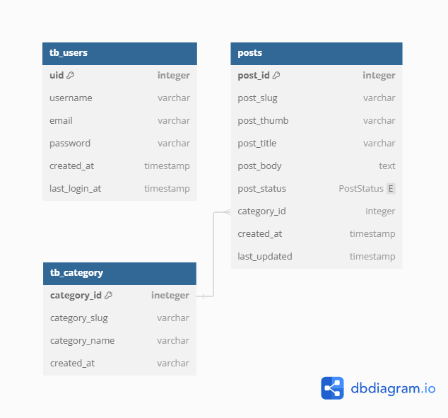

# Meow CMS

Meow CMS is a content management system developed for the Smart Tech Class Himatif 2024. It features user management, post management, and post category management functionalities. The project is built using PHP native, MySQL, and SB Admin 2 template as a dashboard.

## Features

- User Management: Allows administrators to manage users, including adding, editing, and deleting user accounts.
- Post Management: Enables users to create, edit, and delete posts. Posts can be categorized for better organization.
- Category Management: Provides the ability to manage post categories, including adding, editing, and deleting categories.

## Technologies Used

- PHP Native: Backend development language.
- MySQL: Database management system for storing data.
- SB Admin 2 Template: Admin dashboard template for the user interface.

<!-- ## Installation

1. Clone the repository: `git clone https://github.com/yourusername/meow-cms.git`
2. Import the database schema from `database.sql`.
3. Configure the database connection in `config.php`.
4. Run the application using a local server environment.

## Usage

1. Login to the admin dashboard.
2. Use the sidebar menu to navigate through user, post, and category management sections.
3. Manage users, create and manage posts, and manage post categories as needed.

## Credits

- SB Admin 2 Template: [Start Bootstrap](https://startbootstrap.com/theme/sb-admin-2)

## License

This project is licensed under the [MIT License](LICENSE). -->

## ERD Meow CMS

Here is the Entity-Relationship Diagram (ERD) for Meow CMS:

## Flowchart Meow CMS

Here is the flowchart for Meow CMS:

